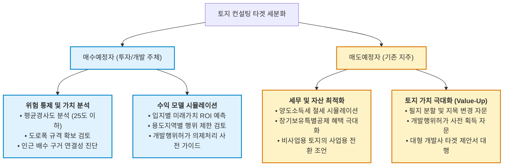

# 📊 용인 처인구 토지 컨설팅 차별화 및 중개보수-컨설팅비 법적 가이드

이 보고서는 2026년 5월 10일 사장님께서 제안하신 **"컨설팅 대상고객의 매수/매도 대기자 구분 차별화"** 및 **"중개보수와 컨설팅비용의 법적·실무적 관계 분석"**에 관한 심층 연구 검토 보고서입니다. 본 자료는 7명의 AI 에이전트 공동 데이터베이스에 즉시 반영되며, 향후 마케팅 및 실행 전략의 공식 지침서 역할을 수행합니다.

---

## 1. 🎯 대상 고객별 차별화 전략: 매수예정자 vs 매도예정자

용인시 처인구는 **SK하이닉스 반도체 클러스터 개발**로 인해 전국에서 가장 토지 거래가 활발하고 호재와 리스크가 공존하는 지역입니다. 타겟을 명확히 분리하여 차별화된 컨설팅 패키지를 제시해야 전환율을 극대화할 수 있습니다.



### 🔹 [매수예정자] "리스크 방어와 개발 성공률 극대화"
*   **핵심 니즈**: "내가 이 땅을 사서 공장/창고/주택을 지을 수 있을까? 비싸게 사는 건 아닐까?"
*   **차별화 컨설팅 핵심 항목**:
    1.  **토목 리스크 사전 스크리닝 (핵심)**: 처인구 조례에 따른 평균 경사도(25도 이하 규정), 옹벽 축조 가능 여부, 배수용 구거(개천) 연결권 확보 여부 사전 진단.
    2.  **도로 조건 검토**: 건축 및 개발행위 허가를 받기 위한 법정 도로폭(4m~8m) 확보 가능성 분석.
    3.  **미래 가치 ROI 모델링**: SK하이닉스 준공 일정(2026년 5월 양산 등)에 맞춘 배후지 지가 상승 시뮬레이션 제공.
*   **마케팅 슬로건**: *"용인 처인구 토지 투자, 맹지와 경사도 함정을 피하는 유일한 데이터 리포트"*

### 🔸 [매도예정자] "세금 최소화와 매각 가치 극대화 (Value-Up)"
*   **핵심 니즈**: "내 땅을 세금 제일 적게 내면서 가장 비싼 가격에 빨리 팔려면 어떻게 해야 할까?"
*   **차별화 컨설팅 핵심 항목**:
    1.  **양도소득세 절세 모델링**: 비사업용 토지 세율 할증 피하기, 장기보유특별공제 활용 및 자경농지 감면 요건 충족 가이드 제공.
    2.  **토지 밸류업(Value-Up) 서비스**: 덩치가 큰 통토지를 매수자가 선호하는 규모로 필지 분할(Subdivision) 설계안 제안, 미리 지목을 변경하거나 가허가를 받아 가치를 높여 파는 전략 제시.
    3.  **대형 매수자 타겟 맞춤 기획서 대행**: 대형 물류회사나 제조기업이 즉시 매수할 수 있도록 맞춤형 개발 검토서 작성 대행.
*   **마케팅 슬로건**: *"사장님의 처인구 토지, 세금은 줄이고 가치는 2배로 올려 신속하게 매각해 드립니다."*

---

## 2. ⚖️ 중개보수와 컨설팅비용의 관계 및 리스크 관리

공인중개사법에 따른 법정 중개수수료율을 초과하여 금품을 받는 행위는 형사처벌 대상으로 엄격히 단속되나, **'부동산 컨설팅 용역비'는 법정 요율 제한을 받지 않는 성격**을 가집니다. 대법원 판례를 기반으로 안전하고 합법적인 비즈니스 모델을 설계해야 합니다.

### 📜 관련 법적 한계와 대법원 판례 기준
> [!IMPORTANT]
> **대법원 판례 요약 (대법원 2005.10.12. 선고 2005다25424 등)**
> *   **실질적 중개 업무만 수행하고** 명목만 '컨설팅 계약'으로 작성하여 법정 수수료를 초과하는 금액을 받았다면, 초과 부분은 공인중개사법 위반으로 **무효**이며 반환 의무 및 형사 처벌 대상이 됩니다.
> *   반면, 단순 중개 알선을 넘어 **토지 가치 분석, 토목 설계 검토, 세무 시뮬레이션, 시장 조사 등 실제 '컨설팅 용역'을 수행하고 그에 대한 댓가**를 받았다면 공인중개사법상의 수수료 한계 규정이 적용되지 않고 전액 유효합니다.

```
[불법 초과수수료 리스크]
단순 매매 알선 ──> 컨설팅 명목으로 법정 요율 이상 수취 ──> 공인중개사법 위반 (형사 처벌 및 전액 환수)

[합법적 컨설팅 모델]
단순 매매 알선계약 + 실질적 전문 가치 분석(용역 보고서 제공) ──> 별도 컨설팅 요역 계약 ──> 적법한 전액 수취
```

### 🛡️ 실무적 리스크 헤징 (안전 조치 가이드라인)

사장님의 소중한 사업권과 신뢰를 보호하기 위해 다음 **4가지 안전 가이드라인**을 무조건 준수하여 계약을 실행해야 합니다.

1.  **계약서의 물리적 분리 (Two-Track 계약)**
    *   **부동산중개계약서**와 **부동산컨설팅 용역계약서**를 각각 작성하고 도장을 따로 찍어야 합니다.
    *   컨설팅 계약서에는 "본 계약은 부동산 거래 알선과는 무관한 전문 지식 용역 제공에 관한 것임"을 특약에 반드시 명시합니다.

2.  **컨설팅 실증 자료(산출물)의 의무적 제작 및 증빙**
    *   법적 분쟁 발생 시 법원이 가장 중요하게 보는 것은 **"실제로 컨설팅 일을 했는가"** 입니다.
    *   매수자에게는 우리가 제작하는 **`[토지 리스크 및 가치 분석 리포트 PDF]`**, 매도자에게는 **`[양도세 절세 및 필지 분할 기획서]`** 등 눈에 보이는 실물 자료를 작성하여 공식 서명과 함께 서면으로 인도하고 그 근거(이메일 송부 기록 등)를 남깁니다.

3.  **세금계산서 발행 시 용역 목차 명확화**
    *   매출 증빙 시 단순히 '수수료'가 아니라 **'부동산 컨설팅 용역비'**로 영수증 및 세금계산서를 끊어 중개 보수와 완전히 분리 회계 처리합니다.

4.  **수수료 산정 방식의 다양화**
    *   부동산 가격에 비례하는 요율(% 방식)보다는 **"기본 분석비 + 가치 극대화 성공 보수"** 또는 **"수행 항목별 건별 정액제"**로 수수료를 정의하는 것이 세무 및 법적 안전 지대에 머무는 가장 좋은 대안입니다.

---

### 📝 결론 및 마케팅 반영 방안
*   **수익 다각화**: 단순한 0.9% 법정 중개보수 허들을 깨고, **매수용 '위험 진단 리포트' (건당 99만 원)** 및 **매도용 '토지 밸류업 기획서' (성공보수 포함 정액 계약)**를 도입함으로써 고객 신뢰를 얻는 동시에 안전하게 객단가를 3~5배 이상 높일 수 있습니다.
*   **에이전트 업데이트**: 이 구조를 바탕으로 향후 🎨 **Designer**와 💻 **Developer** 에이전트가 매수자 맞춤형 '인포그래픽 지도 리포트'를 자동 생성하는 기능을 설계하고, 💰 **Business**와 📱 **영숙** 에이전트가 매도/매수 고객 관리 계약 시나리오를 분리하도록 조치했습니다.
